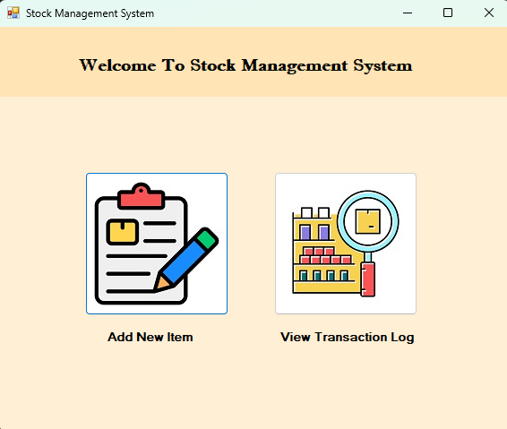
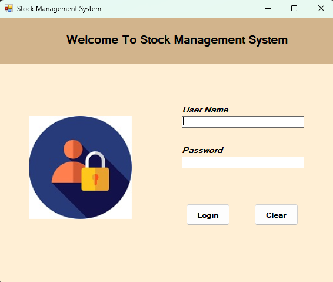
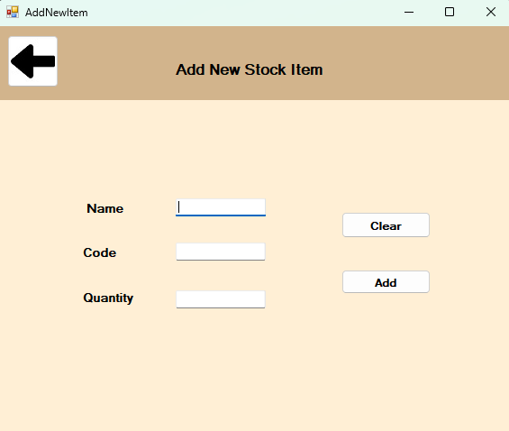

# Stock Management System

A comprehensive C# Windows Forms application for managing inventory and tracking stock transactions.

## 📋 Overview

This Stock Management System provides businesses with a user-friendly interface to efficiently track, manage, and monitor inventory items. The system includes user authentication, stock item management, and transaction logging capabilities.

## ✨ Features

- **Secure Authentication**: User login system with credential validation
- **Stock Management**: Add new inventory items with unique item codes
- **Transaction Logging**: Track all inventory changes with timestamps
- **Data Visualization**: View transaction history in a structured grid
- **Error Handling**: Comprehensive validation and error handling
- **User-Friendly Interface**: Clean and intuitive Windows Forms UI

## 🖼️ Screenshots

### Add New Item


### Main Dashboard


### Login Screen


## 🛠️ Technology Stack

- **Programming Language**: C# (.NET Framework 4.7.2)
- **UI Framework**: Windows Forms
- **Database**: MySQL
- **ORM/Data Access**: MySQL.Data (MySqlConnector)
- **Development Environment**: Visual Studio

## 📊 Database Schema

The application uses a MySQL database with the following structure:

- **Database Name**: `stockitems`
- **Tables**:
  - `Login`: Stores user authentication credentials
  - `stockitems`: Manages inventory items information
  - `transactionlog`: Records all inventory transactions

## 📋 System Requirements

- Windows 7 or later
- .NET Framework 4.7.2 or later
- MySQL Server 5.7 or later
- Minimum 4GB RAM
- 100MB available disk space

## 🚀 Installation Guide

### Prerequisites
1. Install [.NET Framework 4.7.2](https://dotnet.microsoft.com/download/dotnet-framework/net472) or later
2. Install [MySQL Server](https://dev.mysql.com/downloads/mysql/)

### Database Setup
1. Open MySQL Workbench or your preferred MySQL client
2. Create a new database named `stockitems`:
   ```sql
   CREATE DATABASE stockitems;
   ```
3. Create the required tables:
   ```sql
   USE stockitems;
   
   CREATE TABLE Login (
       id INT AUTO_INCREMENT PRIMARY KEY,
       userName VARCHAR(50) NOT NULL,
       password VARCHAR(50) NOT NULL
   );
   
   CREATE TABLE stockitems (
       id INT AUTO_INCREMENT PRIMARY KEY,
       itemcode INT NOT NULL UNIQUE,
       itemname VARCHAR(100) NOT NULL,
       quantity INT NOT NULL
   );
   
   CREATE TABLE transactionlog (
       id INT AUTO_INCREMENT PRIMARY KEY,
       action VARCHAR(50) NOT NULL,
       stockCode INT NOT NULL,
       stockName VARCHAR(100) NOT NULL,
       quantityAdded INT NOT NULL,
       date TIMESTAMP DEFAULT CURRENT_TIMESTAMP
   );
   ```
4. Add a default login:
   ```sql
   INSERT INTO Login (userName, password) VALUES ('admin', 'admin');
   ```

### Application Setup
1. Clone or download this repository
2. Open the solution file `StockManagementSoftware.sln` in Visual Studio
3. Restore NuGet packages if prompted
4. Update the database connection string in `Login.cs`, `AddNewItem.cs`, `StockItem.cs`, `TransactionLog.cs`, and `ViewTransactionLog.cs` if necessary
5. Build and run the application

## 💻 Usage Instructions

1. **Login**:
   - Launch the application
   - Enter your username and password
   - Click "Login"

2. **Add New Item**:
   - From the main menu, click "Add New Item"
   - Enter a unique item code, name, and quantity
   - Click "Add" to save the item

3. **View Transactions**:
   - From the main menu, click "View Transaction Log"
   - All transactions will be displayed in a data grid
   - Use the "Home" button to return to the main menu

## 🏗️ Project Structure

```
StockManagementSoftware/
├── Login.cs                # User authentication form
├── Form1.cs                # Main menu form
├── AddNewItem.cs           # Form for adding new inventory items
├── ViewTransactionLog.cs   # Form for displaying transaction history
├── StockItem.cs            # Entity class for stock items
├── TransactionLog.cs       # Entity class for transaction logging
├── Program.cs              # Application entry point
└── Resources/              # Application resources and assets
```

## 🤝 Contributing

Contributions are welcome! Please follow these steps to contribute:

1. Fork the repository
2. Create a feature branch (`git checkout -b feature/amazing-feature`)
3. Commit your changes (`git commit -m 'Add some amazing feature'`)
4. Push to the branch (`git push origin feature/amazing-feature`)
5. Open a Pull Request

## 📝 License

This project is licensed under the MIT License - see the LICENSE file for details.

## 👏 Acknowledgements

- [MySQL.Data](https://www.nuget.org/packages/MySql.Data/) - For MySQL database connectivity
- [.NET Framework](https://dotnet.microsoft.com/) - Application framework

## 📞 Contact

Gihan Tharuka - [@GitHub](https://github.com/gihan-tharuka)

Project Link: [https://github.com/gihan-tharuka/Stock-Management-System-C-Sharp](https://github.com/gihan-tharuka/Stock-Management-System-C-Sharp)

---

© 2025 Gihan Tharuka
